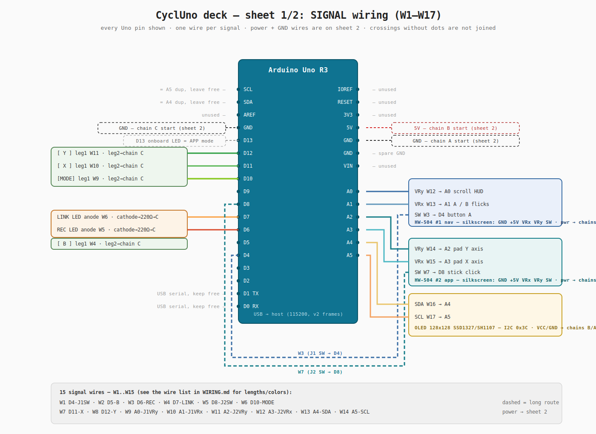
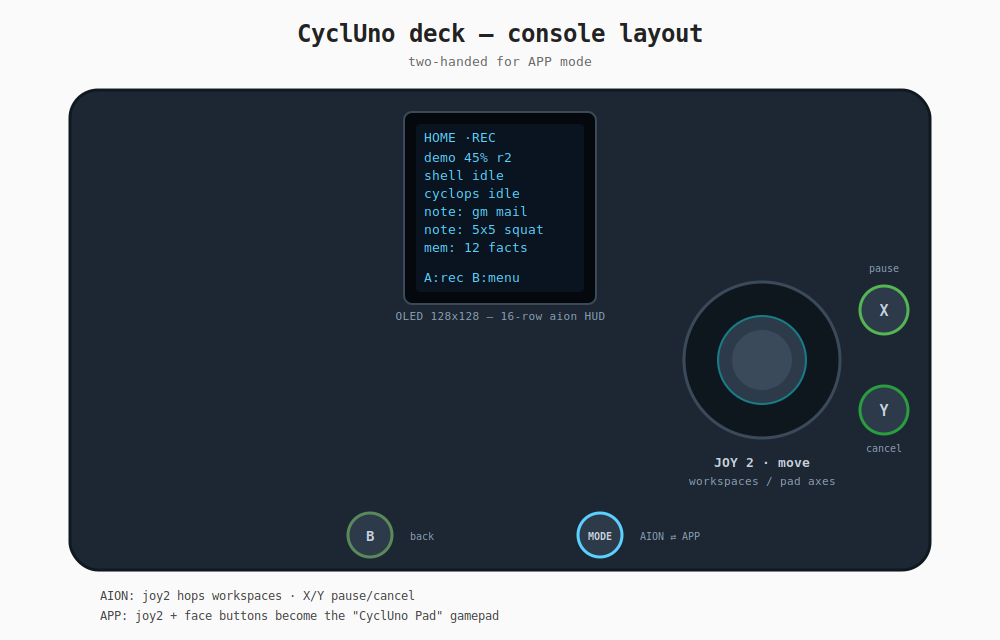

# CyclUno deck — assembly & wiring





## Bill of materials

| Qty | Part | Role |
|-----|------|------|
| 1 | Arduino Uno R3 | brain-side of the cable, input polling |
| 1 | OLED 128x128, I2C — SSD1327 (default) or SH1107 | aion status HUD, 16x16 text grid |
| 2 | HW-504 joystick module | joy1 = nav (left hand), joy2 = app (right hand) |
| 4 | 6x6 mm push button | B (back), MODE, X, Y |
| 2 | LED + 220 Ω resistor | REC, LINK |
| — | breadboard + jumper wires | power rails, everything to GND |

The rotary encoder (KY-040 "wheel") that earlier revisions wired to D2/D3/D9
has been **removed** — navigation is now joystick-only. Everything beyond
joy1 + button B is **optional**: unwired pins read as unpressed (internal
pullups) and the unit degrades to the original single-stick HUD.

## Pin map (single source of truth: `src/main.cpp`)

| Signal | Uno pin | Notes |
|--------|---------|-------|
| OLED SDA / SCL | A4 / A5 | I2C addr **0x3C** (some boards: 0x3D — change `OLED_ADDR`); controller via `DISPLAY_*` define, see below |
| OLED VCC / GND | 5V / GND | power + I2C pull-ups (see wiring notes) |
| OLED RES / DC / CS | — | **I2C boards: tie as below, no Uno pin** |
| OLED BL | 5V | backlight LED — see wiring notes (needs a current limit) |
| Joy1 VRy / VRx | A0 / A1 | nav stick |
| Joy1 SW (= button A) | D4 | active low, pullup |
| Joy2 VRy / VRx | A2 / A3 | app stick |
| Joy2 SW | D8 | stick click |
| Button B | D5 | back / menu |
| Button MODE | D10 | AION ⇄ APP toggle |
| Button X / Y | D11 / D12 | pause / cancel (AION), pad west/north (APP) |
| REC LED | D6 | via 220 Ω to GND |
| LINK LED | D7 | via 220 Ω to GND |
| APP-mode LED | D13 | onboard — nothing to wire |

## Per-pin fan-out (direct wiring, no breadboard)

Every signal pin carries exactly **one** wire; only 5 V and GND branch.
15 signal wires + the power tree, 19–25 wires total depending on chaining.

| Uno pin | wires out | destination |
|---------|-----------|-------------|
| D4 | 1 | HW-504 #1 SW |
| D5 | 1 | button B |
| D6 | 1 | REC LED anode |
| D7 | 1 | LINK LED anode |
| D8 | 1 | HW-504 #2 SW |
| D10 | 1 | button MODE |
| D11 | 1 | button X |
| D12 | 1 | button Y |
| D13 | 0 | onboard LED — nothing to wire |
| A0 | 1 | HW-504 #1 VRy |
| A1 | 1 | HW-504 #1 VRx |
| A2 | 1 | HW-504 #2 VRy |
| A3 | 1 | HW-504 #2 VRx |
| A4 | 1 | OLED SDA |
| A5 | 1 | OLED SCL |
| **5V** | 1 socket, **3 loads** | OLED VCC · joy1 +5V · joy2 +5V |
| **GND** | 3 sockets, **10 returns** | see split below |

**5 V**: the Uno header has a single 5V socket. Run one wire to a splice
(solder joint, Wago, or a chain) and branch 3 ways from there — or
daisy-chain module-to-module: `5V → joy1 → joy2 → OLED`.

### OLED wiring notes (the 128x128 panel has more than 4 pins)

Three display controllers are supported, compile-selected via `main.cpp`:

| Controller | Resolution | Build flag | Typical module |
|------------|-----------|------------|----------------|
| SSD1327    | 128×128   | *(default)* | Waveshare 128×128, 1.5" |
| SH1107     | 128×128   | `-DDISPLAY_SH1107_128X128` | Generic 128×128, often labelled "SH1107 I2C" |
| SSD1306    | 128×64    | `-DDISPLAY_SSD1306_128X64` | Legacy 0.96" — clips to top 8 rows |

All three use **HW I2C** (`U8X8_*_HW_I2C`), with every control pin set to
`U8X8_PIN_NONE` in `src/main.cpp` (lines 40–44). So only **VCC, GND, SDA, SCL**
actually reach the Uno. The breakout still exposes four more pins — here is
what to do with each:

| Pin | I2C-board handling | Why |
|-----|-------------------|------|
| **SDA** | → Uno A4 | I2C data (module has its own pull-up to VCC) |
| **SCL** | → Uno A5 | I2C clock (module has its own pull-up to VCC) |
| **VCC** | → 5 V rail | logic + panel power; most 128×128 modules have an onboard 3.3 V regulator — safe on 5 V. If using a **bare panel** with no regulator PCB, feed 3.3 V instead |
| **GND** | → − rail | return for everything |
| **RES** (reset) | tie to **VCC** (or 5 V via a 10 kΩ pull-up) | I2C builds let the SSD1327/SH1107 use their internal POR — but a floating RES pin can couple noise and prevent boot. Driving it high (direct to VCC or pulled up) guarantees a clean release. **Do not leave floating** |
| **DC** (data/cmd) | tie to **GND** | I2C ignores DC — fix it low to keep the internal mux in data mode. Some modules silkscreen `DC` as `D/C`; if the display shows vertical bars or garbage, try DC→**VCC** instead |
| **CS** (chip select) | tie to **GND** | I2C variants ignore CS; grounding it forces the I2C interface active. On SPI-backpack boards this is what tells the onboard translator to listen on SDA/SCL |
| **BL** (backlight) | → 5 V **through a resistor** (see below) | it is an LED, not a logic pin — see backlight note |

**Identifying your controller (SSD1327 vs SH1107):** the two are NOT software-
compatible — flashing the wrong `DISPLAY_*` gives garbage pixels. Quick checks:
- **SSD1327** 128×128 draws 16 rows of 16×8-pixel tiles. Text is crisp, no
  inter-pixel gaps. Waveshare, Adafruit, and most "1.5" OLED 128×128 I2C"
  modules use this.
- **SH1107** 128×128 has a 132×132 physical framebuffer (the extra 4 columns
  on each axis are RAM padding, usually invisible). Pixel mapping is slightly
  different — SSD1327 firmware on an SH1107 panel shows every 4th column
  missing or shifted. If your screen looks like a chessboard, switch defines.
- **Telltale:** read the IC part number printed on the flex cable or the
  back of the glass. Failing that, try both defines — one will work, the
  other will be garbage. No physical damage risk. |

**Backlight (BL):** the white/blue OLED backlight is a bare LED that wants
roughly **10–20 mA** at ~3 V, so drive it from 5 V through a series resistor
(~150–220 Ω) — straight off 5 V without a resistor will burn it out. If you
don't care about brightness control, a fixed resistor is fine. (Don't wire BL
into the joystick/button GND chain — give it its own 5 V→resistor→BL→GND leg.)

**Power budget:** the 128×128 OLED draws ~20–30 mA (panel + backlight
combined — more if every pixel is white). The Uno's 5 V regulator is rated
for 800–1000 mA; the whole deck (OLED + 2 joysticks + LEDs + buttons) stays
under ~80 mA. USB-powered, no concerns. On battery (if you ever run the Uno
off VIN), the OLED is the largest single draw — expect ~2–3 hours from a
standard 9 V battery.

> Some "I2C" 128x128 modules are really SPI boards with an I2C backpack, or
> ship with RES/DC/CS already bridged for I2C on the back of the PCB. If your
> board boots fine with only VCC/GND/SDA/SCL wired, leave the other three
> pins floating and trust the bridge. The table above is the safe fallback.

**Verifying the I2C pull-ups:** the table assumes the module has 4.7 kΩ
pull-ups to VCC on SDA/SCL. Most factory-assembled 128×128 OLED modules do,
but some bare breakout boards skip them. If the I2C bus is dead (the OLED
stays dark even with correct RES/DC/CS ties and the right address), check with
a multimeter or scope for a ~3.3–5 V pull-up on SDA/SCL. Missing? Add
**two 4.7 kΩ resistors**: one from SDA to VCC, one from SCL to VCC.

**U8X8 address gotcha:** the firmware calls
`u8x8.setI2CAddress(OLED_ADDR << 1)` (`src/main.cpp:154`) — U8X8 expects the
**8-bit I2C address** (0x78 for a 0x3C device, or 0x7A for 0x3D). If you
ever need to swap the display driver in `main.cpp`, keep the `<< 1` shift;
it is correct for the U8X8 API. An I2C scanner sketch (`Wire.begin()` then
`Wire.requestFrom()`) reports the **7-bit** address (0x3C), which can cause
confusion — the firmware value `OLED_ADDR` is the 7-bit form; the `<< 1`
conversion happens at runtime.

| OLED dark / won't boot | check RES/DC/CS ties first (RES→VCC, DC→GND, CS→GND), then I2C addr 0x3D, then A4/A5 — also verify the module has pull-ups |

**GND**: the Uno has 3 GND sockets (two on the power header, one on the
digital header next to D13). 10 things need a return; a sane split:

| GND socket | chain |
|------------|-------|
| power #1 | joy1 GND → joy2 GND → OLED GND (module chain) |
| power #2 | button B → MODE → X → Y (one wire hopping leg-to-leg) |
| digital (by D13) | REC resistor → LINK resistor |

**No extra GND for the clicks**: HW-504 SW switch against their own module's
GND pin internally — the module GND wire already carries them. Only the 4
standalone push buttons need a GND leg.

### I2C notes (the OLED pair)

- Exactly **2 signal wires**: A4 → SDA, A5 → SCL (plus VCC/GND from the
  power chain). No resistors to add: these OLED modules carry their own
  pull-ups to VCC (4.7 kΩ typ). If you get no display and the module lacks
  pull-ups, add two external 4.7 kΩ resistors (SDA→VCC, SCL→VCC).
- On an Uno R3 the two sockets labeled **SDA/SCL next to AREF are the same
  net as A4/A5** — use whichever is handier, they are not extra pins. And
  since I2C owns them, A4/A5 are not available as analog inputs.
- The firmware runs the bus at **400 kHz** (`u8x8.setBusClock(400000L)`):
  keep the SDA/SCL pair short (< ~25 cm) and routed together, away from
  the joystick analog lines. Longer run needed? Drop to 100 kHz
  (`u8x8.setBusClock(100000L)` in `src/main.cpp`, line 156).
- I2C is a **bus**: future devices (e.g. the MCP23017 button expander from
  the upgrade notes) piggyback on the *same two wires* in parallel — new
  address, zero new Uno pins. Just don't duplicate address 0x3C.

### Running an I2C scan

If the OLED stays dark and you have verified wiring, upload a minimal I2C
scanner to confirm the bus is alive:

```cpp
#include <Wire.h>
void setup() {
  Serial.begin(115200);
  Wire.begin();
  Serial.println("I2C scan:");
  for (byte addr = 1; addr < 127; addr++) {
    Wire.beginTransmission(addr);
    if (Wire.endTransmission() == 0) {
      Serial.print("found 0x"); Serial.println(addr, HEX);
    }
  }
}
void loop() {}
```

If the scan returns **0x3C** (or 0x3D), the module is answering — the problem
is in the control-pin strapping, not the bus. If the scan returns nothing,
check VCC/GND, pull-ups, and that A4/A5 are not swapped.

### SH1107 vs SSD1327 — spotting the difference

The two controllers accept the same I2C commands but map pixels differently:
SSD1327 has 128×128 native RAM; SH1107 has 132×132 (the extra 4 columns on
each edge are RAM padding the display ignores).

| Symptom | Likely cause | Fix |
|---------|-------------|-----|
| Text readable but every 4th column blank | SSD1327 firmware on SH1107 hardware | rebuild with `-DDISPLAY_SH1107_128X128` |
| Image shifted 4 columns right | SH1107 firmware on SSD1327 hardware | rebuild with the default (no flag) |
| Random pixel noise / "snow" | wrong controller *or* RES pin floating | tie RES→VCC then rebuild |

If you cannot read the IC marking, just try both defines — no damage risk.

## Assembly order (each step leaves a working unit)

1. **Power rails.** Uno 5V → breadboard + rail, Uno GND → − rail.
2. **OLED.** VCC/GND → rails, SDA → A4, SCL → A5. **RES→VCC, DC→GND,
   CS→GND** (I2C boards — see "OLED wiring notes" above). **BL** → 5 V
   through a 150–220 Ω resistor → GND (own leg, not the button chain).
   Flash (`make flash`): the HUD boots to "CyclUno ready". The default build
   drives an SSD1327 128x128; other panels are one build flag away:

   ```bash
   make flash                                                # SSD1327 128x128 (default)
   PLATFORMIO_BUILD_FLAGS=-DDISPLAY_SH1107_128X128  make flash
   PLATFORMIO_BUILD_FLAGS=-DDISPLAY_SSD1306_128X64  make flash   # legacy panel
   ```

3. **Joy1.** VCC/GND → rails, VRy → A0, VRx → A1, SW → D4. Stick scrolls,
   press toggles REC.
4. **Button B** D5 → GND. Menu/back works.
5. **LEDs.** D6 → LED → 220 Ω → GND (REC), same for D7 (LINK).
6. **Joy2.** VCC/GND → rails, VRy → A2, VRx → A3, SW → D8.
7. **Buttons MODE/X/Y.** D10/D11/D12, each to GND. MODE toggles the D13 LED.

## Rules the wiring relies on

- **All buttons and both stick SWs close to GND** — firmware uses
  `INPUT_PULLUP`, no external resistors.
- **Sticks at rest during boot**: the first readings become the calibrated
  centers (joy nav *and* the APP-mode raw stream).

## Smoke test

```bash
make test     # host gate: HUD + joynav + deck logic (no hardware needed)
make build    # AVR compile gate (RAM stays ~56%)
make flash
```

Then from the aion repo: `pip install -e \".[deck]\"` and start `aion` — the
header shows `[DECK]`, the OLED starts mirroring aion status, joy2 moves the
cockpit. Press MODE (`[PAD]` in the header) and
`cat /proc/bus/input/devices | grep -A4 CyclUno` shows the gamepad.

## Troubleshooting

| Symptom | Fix |
|---------|-----|
| a stick direction is mirrored | set `JOY_FLIP_X` / `JOY_FLIP_Y` in `src/main.cpp` |
| OLED dark | wrong controller: rebuild with the other `DISPLAY_*` define; else try addr 0x3D; check A4/A5 not swapped |
| OLED dark (I2C scan returns nothing) | module lacks pull-ups — add 2× 4.7 kΩ SDA→VCC, SCL→VCC; or VCC not getting 5 V |
| OLED dark (I2C scan finds 0x3C) | RES/DC/CS strapping wrong — RES→VCC, DC→GND, CS→GND is the safe default |
| OLED garbled / offset / every-4th-column missing | SSD1327 firmware on an SH1107 panel (or vice versa) — switch the `DISPLAY_*` define |
| OLED shows one row of garbage then blank | RES pin is floating — tie it to VCC (or 5 V via 10 kΩ). The internal POR didn't fire |
| OLED flickers on scroll / text update | bus too long for 400 kHz — shorten SDA/SCL or drop to 100 kHz (`u8x8.setBusClock(100000L)`) |
| OLED very dim | BL resistor too large (e.g. 1 kΩ). Replace with 150–220 Ω for 10–20 mA |
| OLED won't boot / blank after working | power glitch: the 128×128 panel draws more inrush than a small 128×32. Ensure 5 V rail is solid — no loose breadboard jumpers |
| ghost button presses | missing GND leg — every button must return to the − rail |
| APP mode does nothing on the host | `/dev/uinput` permission: `sudo usermod -aG input $USER`, re-login |
